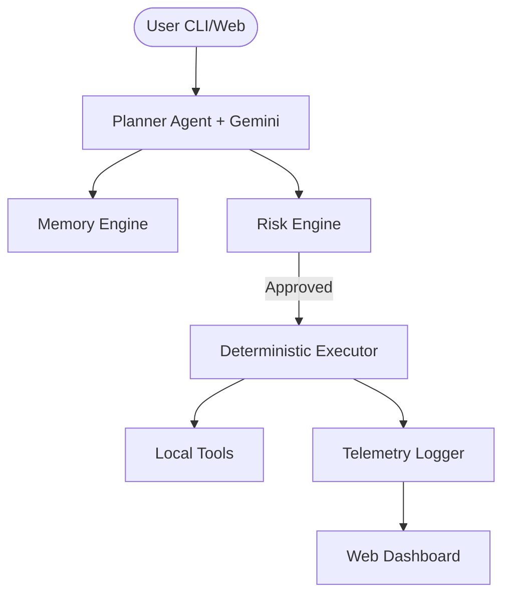

# Dex | Your Personal Cognitive AI Operator

Dex is a local-first, privacy-focused personal AI system that transforms natural language requests into deterministic system actions.

With **Phase 4: Cognitive Core**, Dex evolves into a context-aware operating layer augmented by Gemini 1.5, featuring a **Minimal Intelligence Interface** dashboard and a robust risk engine.

## 🚀 Key Features

- **Gemini Reasoning Layer**: Advanced task decomposition and tool selection with JSON-schema constrained reliability.
- **Minimal Intelligence Interface**: A production-grade dashboard designed for clarity and focused control.
- **Risk Engine**: Three-tier security classification (Low/Medium/High) with human-in-the-loop confirmation.
- **Context Memory Engine**: Local semantic retrieval using SQLite and embeddings for project-level intelligence.
- **Telemetry & Observability**: Real-time performance tracking and tool usage analytics.
- **Local-First & Private**: All data stays on your machine. Dex only uses Gemini for reasoning, never for data storage.

## 🏗 Architecture



## 🛠 Getting Started

### Prerequisites
- Python 3.10+
- Google AI Studio API Key
- Node.js & npm (v18+)

### Installation
1. Clone the repository:
   ```bash
   git clone https://github.com/STiFLeR7/personal-agent-os.git
   cd personal-agent-os
   ```

2. Install backend dependencies:
   ```bash
   pip install -e .[all]
   ```

3. Setup environment:
   ```bash
   cp .env.example .env
   # Add your LLM_API_KEY to .env
   ```

4. Initialize the system:
   ```bash
   dex init
   ```

### Usage
Run a task via CLI:
```bash
dex run "save a note called 'Meeting' with 'Discuss Phase 4 roadmap'"
```

Launch the dashboard:
1. Start the API: `dex dashboard`
2. Start the UI: `cd dashboard && npm run dev`
3. Open `http://localhost:3000`

## 🛡 Security & Privacy
Dex implements a **Deterministic Proposal/Execution** split. 
- **Gemini Proposes**: An LLM generates a structured plan.
- **Dex Validates**: The Risk Engine checks the plan against security policies.
- **User Confirms**: High-risk actions (like shell commands) require manual 'Y/N' confirmation.
- **Dex Executes**: Tools run locally with zero cloud dependence for execution.

## 📜 License
MIT License. See [LICENSE](LICENSE) for details.
