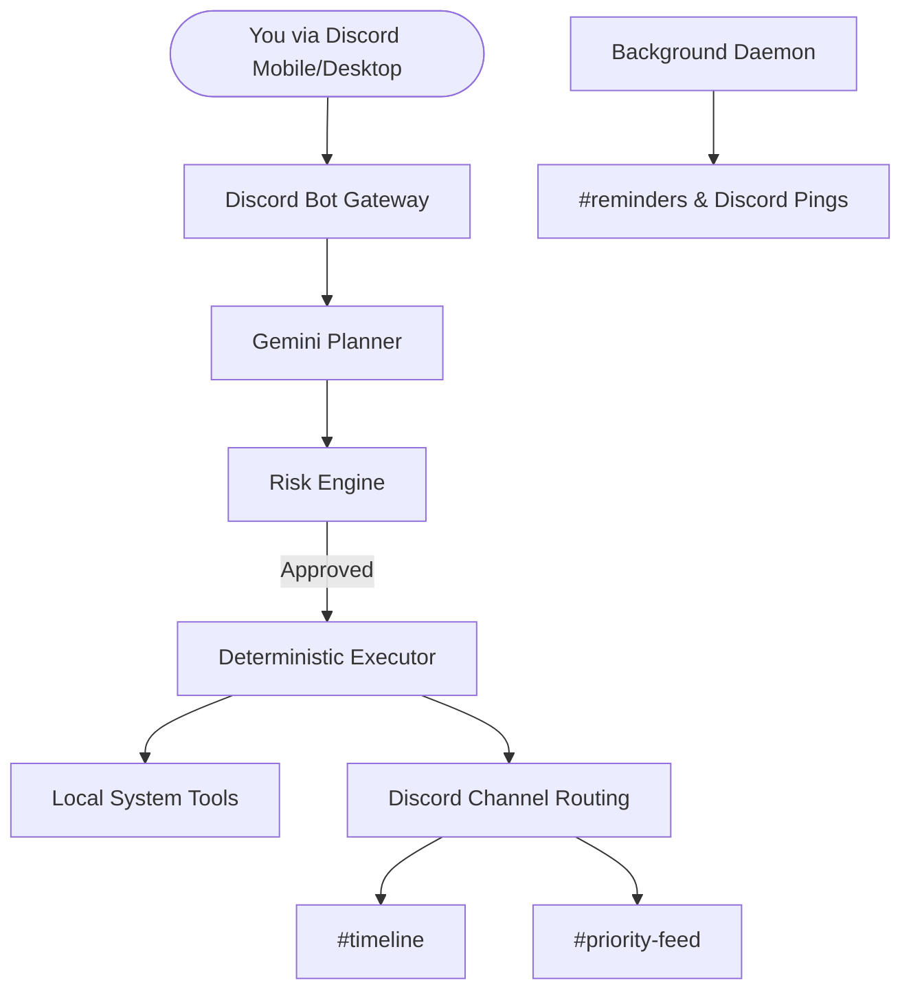

# Dex | Your Personal Discord Cognitive Bot

> **Architecture Version:** v1.0 (Discord-Native Control Plane)  
> **Deployment:** Render (24/7 uptime)

Dex is a local-first, privacy-focused personal AI system that has evolved into a **Discord-native interactive cognitive control plane**. By running Dex on Render and interacting with it through your private Discord server, you get a powerful, context-aware personal assistant that transforms natural language requests into deterministic system actions.

## 🚀 Key Features

- **Discord-Native Control**: Interact with your local machine or cloud instance from anywhere using your personal Discord server.
- **Channel Routing**: Organized output across specific channels (`#console`, `#timeline`, `#priority-feed`, etc.) to reduce spam and keep logs clean.
- **Gemini Reasoning Layer**: Advanced task decomposition and tool selection with JSON-schema constrained reliability.
- **Risk Engine**: Three-tier security classification (Low/Medium/High) with human-in-the-loop confirmation directly via Discord UI buttons.
- **Background Daemon**: A built-in daemon that monitors your reminders and system events, pinging you in Discord when it's time.
- **Local-First & Private**: All data stays on your machine or private instance. Dex only uses Gemini for reasoning, never for data storage.

## 🏗 Why Discord Instead of a Custom Frontend?

Dex moved to a Discord-native interface to prioritize accessibility and reliability:
- **Built-in Auth & UI**: Leverages Discord's secure infrastructure and polished mobile/desktop apps.
- **Channel Isolation**: Clear separation between commands (`#console`), audits (`#timeline`), and alerts (`#priority-feed`).
- **Interactive Confirmations**: native Discord buttons provide a seamless "Human-in-the-Loop" security experience.
- **Zero UI Maintenance**: Focuses engineering effort on the cognitive core rather than frontend boilerplate.

## 📦 Deployment Modes

| Mode          | Status      |
| ------------- | ----------- |
| Local CLI     | Deprecated  |
| Local Docker  | Supported   |
| Render (24/7) | Recommended |
| VPS           | Supported   |

## ✅ Implementation Status

| Feature                       | Status |
| ----------------------------- | ------ |
| Gemini JSON Planning          | ✅      |
| Risk Engine                   | ✅      |
| Human Confirmation            | ✅      |
| Reminder Daemon               | ✅      |
| Email Integration             | ✅      |
| WhatsApp (Twilio)             | ⏳      |
| Telemetry Dashboard           | ⏳      |
| Policy Engine (Advanced Risk) | ⏳      |

## 🏗 Discord Architecture



## 🛠 Getting Started

### Prerequisites
- Python 3.10+ or Docker Desktop
- Google Gemini API Key (`LLM_API_KEY`)
- Discord Bot Token & Guild (Server) ID
- Discord Webhook URL (for daemon alerts)

### Installation (Docker - Recommended)

Everything runs in a single package using Docker Compose. This runs both the Discord listening bot and the background daemon that handles your reminders.

1. Clone the repository:
   ```bash
   git clone https://github.com/STiFLeR7/personal-agent-os.git
   cd personal-agent-os
   ```

2. Setup your `.env` file (see `.env.example`):
   ```env
   # LLM
   LLM_PROVIDER=google
   LLM_API_KEY=your_gemini_key

   # Discord
   DISCORD_BOT_TOKEN=your_bot_token
   DISCORD_GUILD_ID=your_server_id
   DISCORD_WEBHOOK_URL=your_webhook_url
   DISCORD_CONSOLE_CHANNEL=console
   ```

3. Boot the system:
   ```bash
   docker-compose up -d --build
   ```

## 🛡 Security & Privacy
Dex implements a **Deterministic Proposal/Execution** split. 
- **Gemini Proposes**: An LLM generates a structured plan based on your Discord command.
- **Dex Validates**: The Risk Engine checks the plan against security policies.
- **You Confirm**: High-risk actions (like shell commands) prompt a confirmation view with Green/Red buttons in Discord.
- **Dex Executes**: Tools run locally on your machine with zero cloud dependence for execution.

## 📖 How to Use
Please read the [HOW_TO_USE.md](HOW_TO_USE.md) file for a detailed guide on setting up your Discord server channels, understanding the routing, and examples of what to type to Dex.

## 📜 License
MIT License. See [LICENSE](LICENSE) for details.
