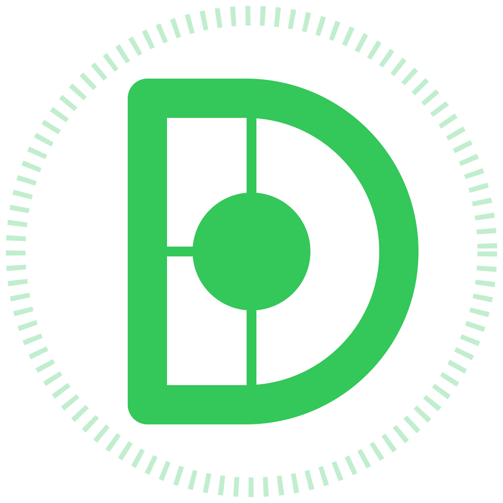
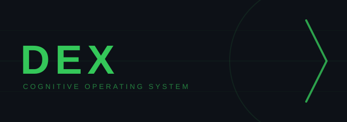

<p align="center">
  
</p>

<h1 align="center">Dex | Personal Discord Cognitive Operator</h1>

<p align="center">
  
  
  
</p>

<p align="center">
  <strong>An elite, proactive cognitive control plane living in your private Discord.</strong><br>
  Dex is a dual-core AI operator that manages your digital life through planning, task management, and multi-channel delivery.
</p>

<p align="center">
  
</p>

---

## 📖 Overview

Dex is a **Cognitive Operating System** designed for high-performance individuals. It transforms Discord from a chat app into a command center. Unlike traditional bots, Dex uses a **"Hermes-style"** delivery system—it is proactive, branded, and deeply integrated into your server's workflow.

By leveraging **Gemini 2.0 Flash** for reasoning and **Groq (Llama 3.3)** as a high-speed fallback, Dex ensures your personal assistant is always available, always dynamic, and always secure.

### Why Dex?
- **Proactive Intelligence**: Not just a chatbot; Dex initiates tasks and provides daily briefings.
- **Dual-Core Brain**: High-fidelity reasoning with Gemini; ultra-fast fallback with Groq.
- **Branded Interface**: Native Discord embeds with custom branding and "Hermes" messenger layer.
- **Full Interactivity**: Talk to Dex anywhere—`#console`, `#reminders`, `#priority-feed`, or `#general`.

---

## 🏗 Core Architecture

Dex operates on a **Proposal-Execution-Verification** split architecture.

1.  **Conversational Ingestion**: Mention `@Dex` anywhere or use Slash Commands.
2.  **Reasoning**: **Gemini 2.0 Flash** (or **Groq**) generates a structured `ExecutionPlan`.
3.  **Safety Gate**: The **Risk Engine** audits every step for potential system impact.
4.  **Confirmation**: High-risk tasks pause for a native Discord button confirmation.
5.  **Autonomous Execution**: The **ExecutorAgent** runs Python-based tools locally.
6.  **Branded Verification**: Results are verified and posted as rich embeds across your server.

---

## 🚀 Key Features

### ⚡ Hermes Messenger Layer
- **Server-Wide Interactivity**: Dex responds to natural language pings in all designated channels.
- **Dynamic Branded Digest**: A unique, LLM-generated **Morning Intel Digest** at 08:00 AM IST with logo thumbnails and professional formatting.
- **Multi-Channel Delivery**: Seamless handoff between Discord and professional HTML emails.

### 🧠 Master Task Management
- **Reminders**: Precision scheduled time-based alerts.
- **TODOTool**: Persistent daily task tracking and priority management.
- **Integrated Intelligence**: Your daily summary combines reminders, TODOs, and system health telemetry.

### 📡 System Operations
- **Local Memory**: Semantic retrieval of your notes and past task history.
- **Telemetry**: Real-time performance monitoring via `/dex telemetry`.
- **Render Stability**: Automated keep-alive loops and process auto-restart for 100% uptime.

---

## 📦 Deployment & Setup

### Render Deployment (Recommended)
Dex is optimized for **Render**, utilizing a "Double Shield" of stability for the free tier.

1.  **Fork/Clone** the repository.
2.  Create a new **Web Service** on Render (Docker Runtime).
3.  Set the following **Environment Variables** (see `dex.env` for full list):
    - `RENDER_EXTERNAL_URL`: Your public service URL (required for logos).
    - `GEMINI_API_KEY`: Google AI Studio key.
    - `GROQ_API_KEY`: Groq console key (backup brain).
    - `DISCORD_BOT_TOKEN`: From Discord Developer Portal.
    - `NOTIFY_RESEND_ENABLED`: `true` (use Resend for email delivery on Render).

### Local Docker Setup
```bash
docker-compose up -d --build
```

---

## ✅ Implementation Roadmap

| Feature | Status | Description |
| :--- | :---: | :--- |
| **Hermes Interactivity** | ✅ | Server-wide conversational support |
| **Dual-Core LLM** | ✅ | Gemini 2.0 + Groq (Llama 3.3) fallback |
| **TODO Engine** | ✅ | Persistent task management system |
| **Branding Kit** | ✅ | Professional SVG logo and banner integration |
| **Dashboard UI** | ✅ | React-based visual telemetry interface |
| **Voice Activation** | ⏳ | Real-time voice command processing |

---

## 🛡 Security & Ethics
- **Deterministic Guardrails**: LLMs never execute code directly; they propose plans for the deterministic Executor.
- **Local-First Privacy**: Your task data stays in `.agentic_os/` on your host environment.
- **Human-in-the-Loop**: Mandatory button clicks for all system-altering operations.

---

## 📜 License
This project is licensed under the MIT License - see the [LICENSE](LICENSE) file for details.

---
<p align="center">
  Built with ❤️ for the future of personal AI.
</p>
